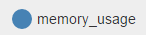

AuditPanel: Juniper Networks Code Challenge
===================


This project gives solution to the code challenge from **Juniper Networks**. 
Toolset include: Javascript, CSS, HTML, jQuery, Bootstrap and D3.js.
Developed and tested on **Chrome**.

----------
Features
-------------
###Charts
* Live bar chart and line chart
* Chart name editable
* Chart color and axis label changeable by click 
* API available

###Form
* Configurable form generator
* API available

Usage
-------------
This project adopts the node server from the source, thus the usage is the same as original.

* Make sure you have NodeJS (v4.x.x and above) installed globally on your machine. Find the detailed installation instruction from https://nodejs.org/en/ 
* Open any command-line prompt, set the current directory to the `app/` folder.
* Run `npm install`
* When the installation is finished, run `npm run start` and open `localhost:8000` in your browser


APIs
-------------
APIs are designed and utilized, and can be easily used in the future
###Chart (mychart.js)
####Bar chart
```javascript
var myChart = new BarChart(parentContainerID, chartName, criteria, upperBound);
```
####Line chart
```javascript
var myChart = new LineChart(parentContainerID, chartName, criteria, upperBound);
```
where `criteria` is an `Array` which represented the keys of criteria from `data`, and using `,` to concatenate hierarchy structure. For example:
```javascript
data = 
{
"cpu_usage":"0.35",
"network_throughput":
	{"in":6177,"out":14821}
}

var criteria_for_cpu_usage = ["cpu_usage"];
var criteria_for_network_throughput = ["network_throughput,in","network_throughput,out"];
```
to update chart, simply use
```javascript
myChart.update(data);
```

###Form (myform.js)
To generate a form whose input boxes can be customized.
```javascript
var form = new dynamicForm(
	dataConfig,
	selectionFormID,
	mainFormID, 
	submitDataCallback, 
	unfinishCallback
);
```
where the `dataConfig` is the object of all possible options, like
```javascript
var dataConfig = {
"properties":{
    "timestamp":{
      "type":"string",
      "required":true,
    },
    "network_throughput":{
      "default_upperbound":20000,
      "properties":{
         "in":{
            "type":"integer",
         },
         "out":{
            "type":"integer",
         }
      }
    },
}
```
This wiil generate a checkbox form, where user change choose which crterion should be includeding in the form. Those with `"required":true` criteria cannot be exclude when customizing.

----------

